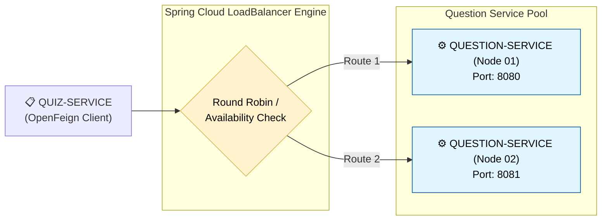

# ⚖️ Client-Side Load Balancing (Spring Cloud LoadBalancer)

This section documents how our ecosystem handles high traffic volumes by scaling our microservice nodes horizontally and balancing incoming requests automatically.

---

## 🗺️ Architectural Concept: Horizontal Scaling

When a specific domain (like our `question-service`) becomes highly utilized, we can scale it out horizontally by spinning up multiple instances of the exact same container application codebase (e.g., Instance A on port `8080` and Instance B on port `8081`). 



## The Magic of Zero-Configuration Balancing
In modern Spring Cloud architectures, **you do not need to configure an external load balancer hardware tool.**

Because the `quiz-service` includes the OpenFeign and Eureka Discovery Client libraries, **Spring Cloud LoadBalancer** is automatically included inside the application's runtime dependencies.

When OpenFeign executes a request via `@FeignClient("QUESTION-SERVICE")`, it pulls all active matching host addresses from Eureka, checks their workloads, and shifts the traffic evenly across the nodes.

## 🔬 Local Validation Verification (Console Logging)
To visually confirm that requests are dynamically switching between backend nodes, we inject Spring's `Environment` interface inside the `QuestionController` to capture the precise port serving each call.

## 💻 Code Implementation

```java
import org.springframework.core.env.Environment; // 👈 Ensure it is Spring Framework, NOT Hibernate!

@RestController
@RequestMapping("question")
public class QuestionController {

    @Autowired
    private Environment environment; // 👈 Dynamically hooks into the running container network environment

    @GetMapping("getQuestions")
    public ResponseEntity<List<QuestionWrapper>> getQuestionsFromId(@RequestBody List<Integer> questionIds) {
        
        // 🛠️ Print the exact port serving this client HTTP request to console
        String currentRunningPort = environment.getProperty("local.server.port");
        System.out.println("🚀 Request successfully handled by Question Service running on Port: " + currentRunningPort);
        
        // Return business payload logic...
        return questionService.getQuestionsFromId(questionIds);
    }
}
```

## 📋 Expected Console Output Behavior
If you repeatedly fire multiple quiz retrieval commands via Postman or your browser, you will witness the console outputs toggle dynamically across your running IDE terminals or terminal container tabs:
- **Terminal Instance 1 Console:** 🚀 `Request successfully handled by Question Service running on Port: 8080`
- **Terminal Instance 2 Console: 🚀** `Request successfully handled by Question Service running on Port: 8081`
